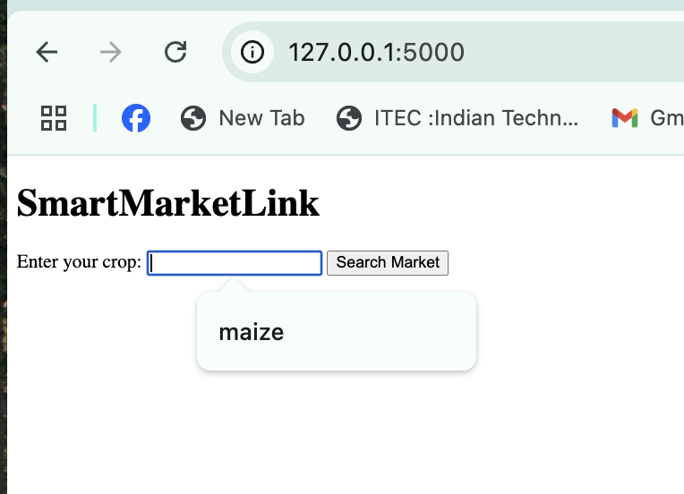
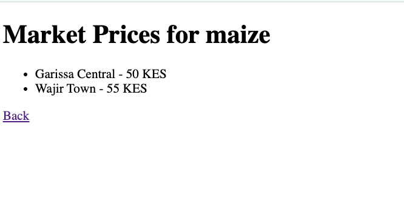

# SmartMarketLink 🌽📈

SmartMarketLink is an AI-ready platform designed to help small-scale farmers access real-time crop market prices in nearby towns like Garissa and Wajir.

---

## 🚀 Problem

Small-scale farmers often lack information about when and where to sell their produce, leading to poor pricing and low profits.

---

## 💡 Solution

This Flask-powered app lets farmers search by crop (e.g., maize) and instantly view prices across markets.

---

## 🔧 Tech Stack

- Flask (Python)
- HTML + Jinja templates
- CSV data (can scale to APIs)
- Google Slides Pitch Deck

---

## 📷 Screenshots

  


---

## 🎯 Pitch Deck

🔗 [Click here to view](https://docs.google.com/presentation/d/1SkbJq5mCVhqUmG3O3h9TBqpxmMmQAc_HcGEC3tYxLq0/edit?usp=sharing)

---

## 🏁 How to Run Locally

```bash
git clone https://github.com/jmsmuigai/SmartMarketLink.git
cd SmartMarketLink
pip install flask pandas
python app.py
